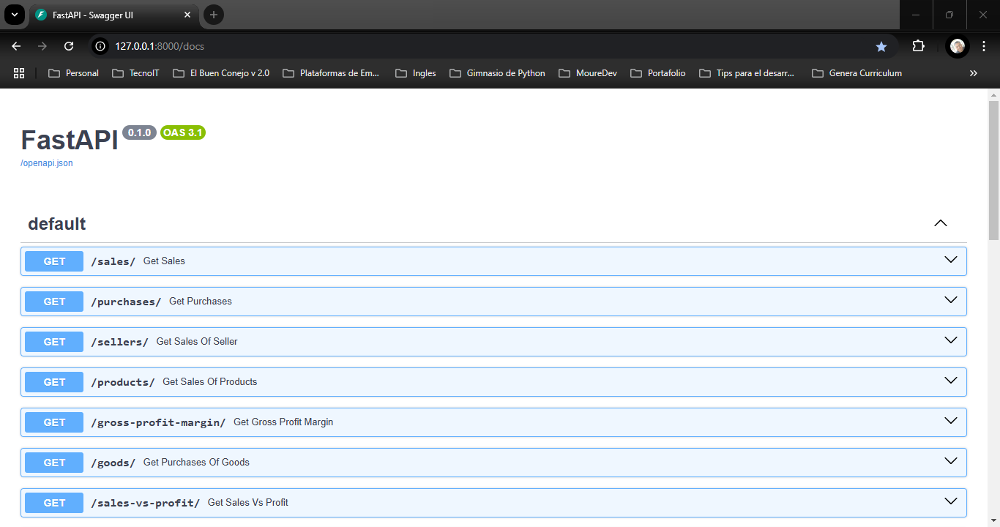
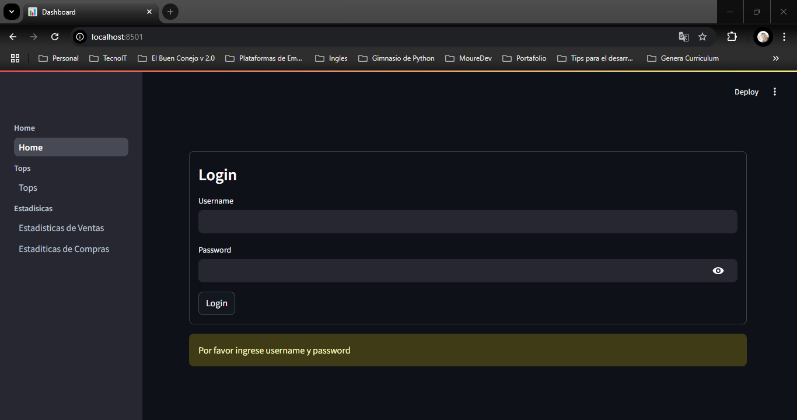
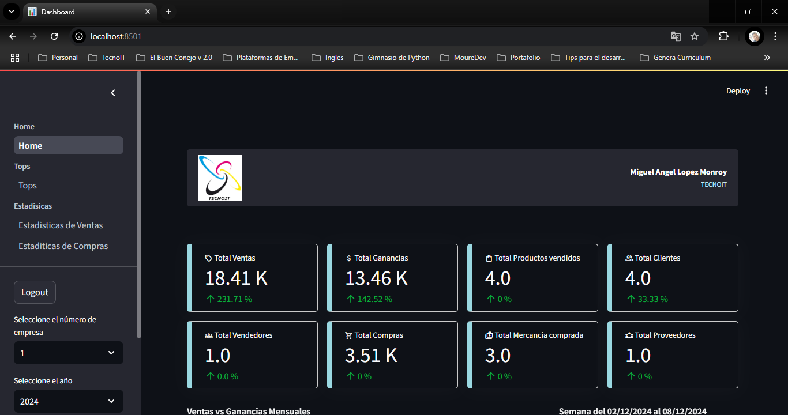
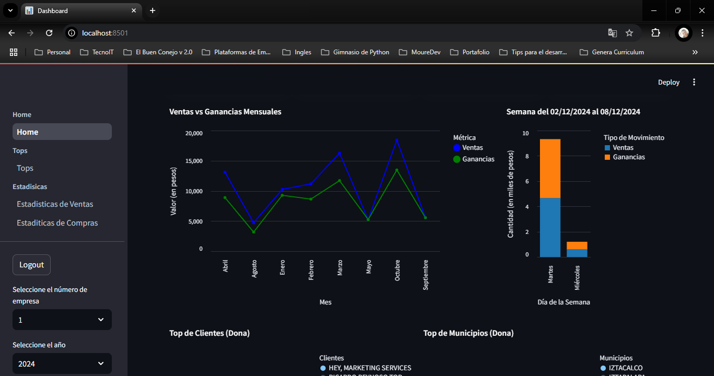
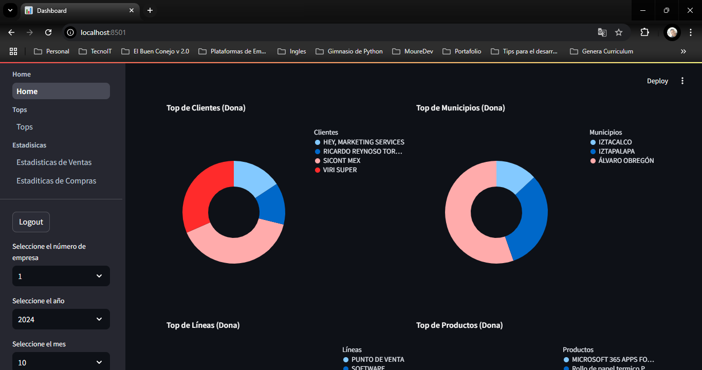
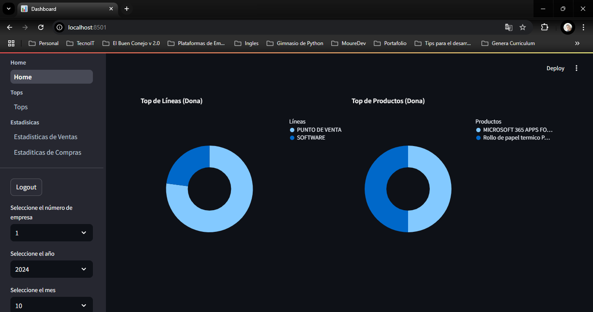

<!-- Improved compatibility of back to top link: See: https://github.com/othneildrew/Best-README-Template/pull/73 -->
<a name="readme-top"></a>
<!--
*** Thanks for checking out the Best-README-Template. If you have a suggestion
*** that would make this better, please fork the repo and create a pull request
*** or simply open an issue with the tag "enhancement".
*** Don't forget to give the project a star!
*** Thanks again! Now go create something AMAZING! :D
-->

<!-- PROJECT SHIELDS -->
<!--
*** I'm using markdown "reference style" links for readability.
*** Reference links are enclosed in brackets [ ] instead of parentheses ( ).
*** See the bottom of this document for the declaration of the reference variables
*** for contributors-url, forks-url, etc. This is an optional, concise syntax you may use.
*** https://www.markdownguide.org/basic-syntax/#reference-style-links
-->
[![Contributors][contributors-shield]][contributors-url]
[![Forks][forks-shield]][forks-url]
[![Stargazers][stars-shield]][stars-url]
[![Issues][issues-shield]][issues-url]
[![MIT License][license-shield]][license-url]
[![LinkedIn][linkedin-shield]][linkedin-url]

<!-- PROJECT LOGO -->
<br />
<div align="center">
  <a href="https://github.com/mikelm2020/dashboard">
    
  </a>

  <h3 align="center">dashboard</h3>

  <p align="center">
    Local Dashboard
  </p>
</div>

<!-- TABLE OF CONTENTS -->
<details>
  <summary>Table of Contents</summary>
  <ol>
    <li>
      <a href="#about-the-project">About The Project</a>
      <ul>
        <li><a href="#built-with">Built With</a></li>
      </ul>
    </li>
    <li>
      <a href="#getting-started">Getting Started</a>
      <ul>
        <li><a href="#prerequisites">Prerequisites</a></li>
        <li><a href="#installation">Installation</a></li>
      </ul>
    </li>
    <li><a href="#usage">Usage</a></li>
    <!-- <li><a href="#roadmap">Roadmap</a></li> -->
    <!-- <li><a href="#contributing">Contributing</a></li> -->
    <li><a href="#license">License</a></li>
    <li><a href="#contact">Contact</a></li>
    <li><a href="#acknowledgments">Acknowledgments</a></li>
  </ol>
</details>

<!-- ABOUT THE PROJECT -->
## About The Project



### Dashboard Home






A local dashboard connected to the Aspel SAE administrative system running on the Windows desktop platform using a Firebird 2.51 database.

In this project the objetives are:
* Connect to a local database Firebird 2.51
* Use Windows Desktop Platform
* Login with username and password
* Show a summary on the home page with sales and profit metrics
* Show sales and purchase statistics
* Show Top tables of:  lines, products, clients, towns and sellers  
* Show donut charts of: top clients, top towns, top lines and top products
* Show lines chart of sales vs profit monthly
* Show stacked bar of sales vs profit weekly

<p align="right">(<a href="#readme-top">back to top</a>)</p>

### Built With

* [![Python][Python]][Python-url]
* [![FastAPI][FastAPI]][FastAPI-url]
* [![Streamlit][Streamlit]][Streamlit-url]
* [![Swagger][Swagger]][Swagger-url]
* [![Windows 11][Windows 11]][Windows 11-url]
* [![Git][Git]][Git-url]

<p align="right">(<a href="#readme-top">back to top</a>)</p>

<!-- GETTING STARTED -->
## Getting Started

### Prerequisites

1. This project use a Firebird 2.51 local database and administrative system Aspel SAE 9.0.
2. Have Aspel SAE 8.0 or 9.0 installed
3. Have Windows 10 u 11 installed
4. Have Python 3.11 o superior installed
5. Have Git y Gitbash installed

### Installation

1. Clone the repository
```sh
   git clone https://github.com/mikelm2020/dashboard.git
```
2. Create the python virtual enviroment
```sh
   python -m venv .venv
```
3. Prepare the virtual enviroment through of local requirements file
```sh
   source .venv/Scripts/activate
   pip install -r requirements.txt
```
4. Create a .env file with enviroment variables in the root folder using environment variables
   of the .env_firebird_example file

5. The enviroment variables are used in the project

6. To deploy this project run the run_streamlit.bat and main.py files how Windows services

<p align="right">(<a href="#readme-top">back to top</a>)</p>

<!-- USAGE EXAMPLES -->
## Usage

The indications for use the dashboard are:
1. Add an user in the config.yaml file
2. Login with the username, and password
3. Navigate on the dashboard menu
4. Use parameters month and year for filter information
5. Logout

<p align="right">(<a href="#readme-top">back to top</a>)</p>

<!-- ROADMAP -->
<!-- ## Roadmap

- [ ] Add CRUD operations for booking and rating
- [ ] Terminate swagger documentation
- [ ] Add Chatbot
- [ ] Add unit testing
- [ ] Add geolocalization
- [ ] Add upload control with Cloudinary -->

See the [open issues](https://github.com/mikelm2020/dashboard/issues) for a full list of proposed features (and known issues).

<p align="right">(<a href="#readme-top">back to top</a>)</p>

<!-- LICENSE -->
## License

Distributed under the MIT License. See `LICENSE.txt` for more information.

<p align="right">(<a href="#readme-top">back to top</a>)</p>

<!-- CONTACT -->
## Contact

Miguel Angel López Monroy - [@miguellopezmdev](https://twitter.com/miguellopezmdev) - miguel.lopezm.dev@gmail.com

<p align="right">(<a href="#readme-top">back to top</a>)</p>

<!-- ACKNOWLEDGMENTS -->
## Acknowledgments

My favorite resources used:

* [Choose an Open Source License](https://choosealicense.com)
* [Sreamlit Documentation](https://docs.streamlit.io/)
* [ChatGPT](https://chatgpt.com/)

<p align="right">(<a href="#readme-top">back to top</a>)</p>

<!-- MARKDOWN LINKS & IMAGES -->
<!-- https://www.markdownguide.org/basic-syntax/#reference-style-links -->
[contributors-shield]: https://img.shields.io/github/contributors/mikelm2020/dashboard.svg?style=for-the-badge
[contributors-url]: https://github.com/mikelm2020/dashboard/graphs/contributors
[forks-shield]: https://img.shields.io/github/forks/mikelm2020/dashboard.svg?style=for-the-badge
[forks-url]: https://github.com/mikelm2020/dashboard/network/members
[stars-shield]: https://img.shields.io/github/stars/mikelm2020/dashboard.svg?style=for-the-badge
[stars-url]: https://github.com/mikelm2020/dashboard/stargazers
[issues-shield]: https://img.shields.io/github/issues/mikelm2020/dashboard.svg?style=for-the-badge
[issues-url]: https://github.com/mikelm2020/dashboard/issues
[license-shield]: https://img.shields.io/github/license/mikelm2020/dashboard.svg?style=for-the-badge
[license-url]: https://github.com/mikelm2020/dashboard/blob/master/LICENSE.txt
[linkedin-shield]: https://img.shields.io/badge/-LinkedIn-black.svg?style=for-the-badge&logo=linkedin&colorB=555
[linkedin-url]: https://linkedin.com/in/miguellopezmdev
[product-screenshot]: https://github.com/mikelm2020/dashboard/blob/82a8c694a418723faacf992c5dd76b6e328120f8/api_playlists.png
[Python]: https://img.shields.io/badge/python-3670A0?style=for-the-badge&logo=python&logoColor=ffdd54
[Python-url]: https://www.python.org/
[FastAPI]: https://img.shields.io/badge/FastAPI-005571?style=for-the-badge&logo=fastapi
[FastAPI-url]: https://fastapi.tiangolo.com/
[Streamlit]: https://img.shields.io/badge/Streamlit-%23FE4B4B.svg?style=for-the-badge&logo=streamlit&logoColor=white
[Streamlit-url]: https://docs.streamlit.io/
[Swagger]: https://img.shields.io/badge/-Swagger-%23Clojure?style=for-the-badge&logo=swagger&logoColor=white
[Swagger-url]: https://swagger.io/
[Windows 11]: https://img.shields.io/badge/Windows%2011-%230079d5.svg?style=for-the-badge&logo=Windows%2011&logoColor=white
[Windows 11-url]: https://www.microsoft.com/es-mx/windows/windows-11?r=1
[Git]: https://img.shields.io/badge/git-%23F05033.svg?style=for-the-badge&logo=git&logoColor=white
[Git-url]: https://git-scm.com/
